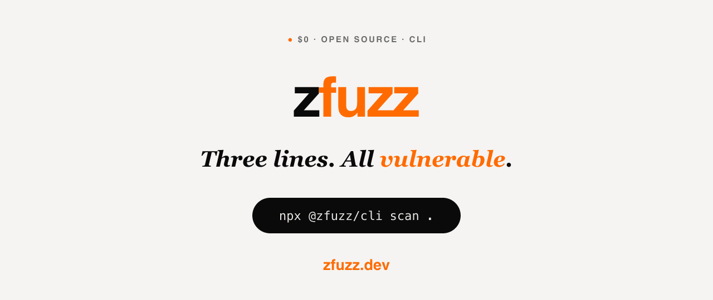

<div align="center">



</div>

# Zfuzz CLI — one command, your whole project scanned

**`npx @zfuzz/cli scan .` → real security findings in seconds.** No install, no setup, no Rust toolchain. Static scanning is free and open source.

`$0` · **Apache-2.0** · Sub-second · Runs 100% locally

---

## Try it right now

```bash
npx @zfuzz/cli scan .                 # scan this project
npx @zfuzz/cli gate --fail-on high    # stop a build when something's serious (exit 1)
npx @zfuzz/cli mcp-serve              # give your AI agent the security tools (MCP)
```

That's the whole thing. `zfuzz` finds injection bugs, leaked API keys, and vulnerable dependencies — the **same engine** behind the MCP server, Guard, the VS Code extension, and the GitHub Action.

---

## Everything it can do

| Command | What it does |
|---|---|
| `zfuzz scan` | SAST + secret scan on your code |
| `zfuzz gate` | CI gate — exits 1 when findings cross your severity |
| `zfuzz sbom` | software bill of materials |
| `zfuzz threat-model` | STRIDE + MITRE view of your project |
| `zfuzz vault` | hide your API keys so your agent can't leak them (Sealed Vault) |
| `zfuzz mcp-serve` | MCP server for Claude Code, Cursor, Codex, Gemini CLI… |

---

## Why it's instant (no compiling)

This wrapper ships **no binary itself**. It pulls the one **pre-built** `zfuzz` binary that matches your machine — `os` + `cpu` (+ libc via `detect-libc`) — from a per-platform package. Ready in seconds, **no Rust toolchain required**. Set `ZFUZZ_BIN=/path/to/zfuzz` to use your own build.

<details>
<summary><b>Honest scope</b></summary>

No binary attestation (Ed25519/SHA-256) is performed yet — the hook point lives in `scripts/run-binary.js`. Until it lands, don't assume a cryptographically verified supply chain.
</details>
---

## License

[Apache-2.0](LICENSE) — free & open source. © Zfuzz

Part of the [Zfuzz](https://zfuzz.dev) security platform.
